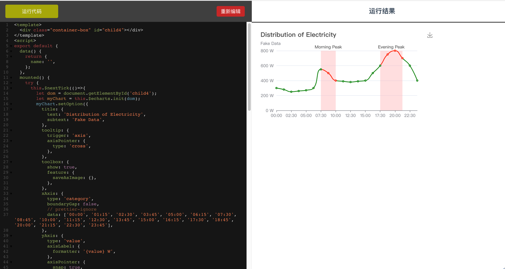

# vue-template-runner

## 启动项目
```
npm install
```

### Compiles and hot-reloads for development
```
npm run serve
```

### Compiles and minifies for production
```
npm run build
```
##项目简介
这是一个基于vue2.6+codeMirror 开发的在线vue-template编辑器

示例代码 在src/components/code.vue
项目跑起来之后复制代码到左边的文本编辑器，点击运行即可

截图如下：


